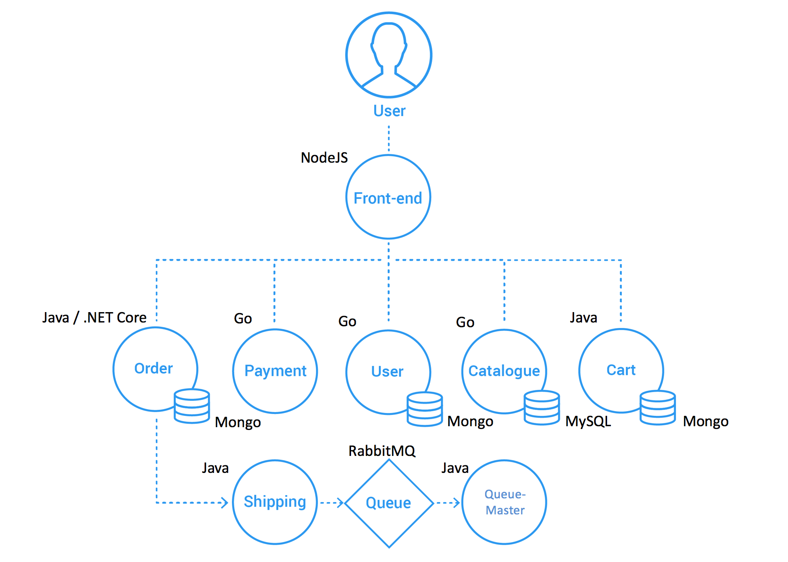

[](https://travis-ci.org/microservices-demo/microservices-demo)

# DEPRECATED: Sock Shop : A Microservice Demo Application

The application is the user-facing part of an online shop that sells socks. It is intended to aid the demonstration and
testing of microservice and cloud native technologies.

It is built using [Spring Boot](http://projects.spring.io/spring-boot/), [Go kit](http://gokit.io)
and [Node.js](https://nodejs.org/) and is packaged in Docker containers.

You can read more about the [application design](./internal-docs/design.md).

## Deployment Platforms

The [deploy folder](./deploy/) contains scripts and instructions to provision the application onto your favourite
platform.

Please let us know if there is a platform that you would like to see supported.

## Bugs, Feature Requests and Contributing

We'd love to see community contributions. We like to keep it simple and use Github issues to track bugs and feature
requests and pull requests to manage contributions. See the [contribution information](.github/CONTRIBUTING.md) for more
information.

## Screenshot


## Visualizing the application

Use [Weave Scope](http://weave.works/products/weave-scope/) or [Weave Cloud](http://cloud.weave.works/) to visualize the
application once it's running in the selected [target platform](./deploy/).


## 架构



### 镜像列表

```yaml
services:
  front-end:
    image: weaveworksdemos/front-end:0.3.12 # 最新镜像 0.3.12 最新版本 0.3.12


  orders:
    image: weaveworksdemos/orders:0.4.7 # 最新镜像 0.4.7 最新版本 0.4.7
  orders-db:
    image: mongo:3.4

  payment:
    image: weaveworksdemos/payment:0.4.3 # 最新镜像 0.4.3 最新版本 0.4.3

  user:
    image: weaveworksdemos/user:0.4.4 # ! 最新镜像 0.4.7 最新版本 0.4.7
  user-db:
    image: weaveworksdemos/user-db:0.4.0 # ! 最新镜像 0.4.7

  catalogue:
    image: weaveworksdemos/catalogue:0.3.5 # 最新镜像 0.3.5 最新版本 0.3.5
  catalogue-db:
    image: weaveworksdemos/catalogue-db:0.3.0 # ! 最新镜像 0.3.5

  carts:
    image: weaveworksdemos/carts:0.4.8 # 最新镜像 0.4.8 最新版本 0.4.8
  carts-db:
    image: mongo:3.4


  shipping:
    image: weaveworksdemos/shipping:0.4.8 # 最新镜像 0.4.8 最新版本 0.4.8
  rabbitmq:
    image: rabbitmq:3.6.8
  queue-master:
    image: weaveworksdemos/queue-master:0.3.1 # 最新镜像 0.3.1 最新版本 0.3.1


  edge-router:
    image: weaveworksdemos/edge-router:0.1.1 # 最新镜像 0.1.1 最新版本 0.1.1
  user-sim:
    image: weaveworksdemos/load-test:0.1.1 # 最新镜像 0.1.1 最新版本 0.1.1

```

### 原始存储库

* https://github.com/microservices-demo/microservices-demo
*
* https://github.com/microservices-demo/front-end
*
* https://github.com/microservices-demo/orders
* https://github.com/microservices-demo/payment
* https://github.com/microservices-demo/user
* https://github.com/microservices-demo/catalogue
* https://github.com/microservices-demo/carts
*
* https://github.com/microservices-demo/shipping
* https://github.com/microservices-demo/queue-master
*
* https://github.com/microservices-demo/edge-router
* https://github.com/microservices-demo/load-test

### fork 的存储库

* https://github.com/YuSitong1999/sock-shop-microservices-demo
*
* https://github.com/YuSitong1999/sock-shop-front-end
*
* https://github.com/YuSitong1999/sock-shop-orders
* https://github.com/YuSitong1999/sock-shop-payment
* https://github.com/YuSitong1999/sock-shop-user
* https://github.com/YuSitong1999/sock-shop-catalogue
* https://github.com/YuSitong1999/sock-shop-carts
*
* https://github.com/YuSitong1999/sock-shop-shipping
* https://github.com/YuSitong1999/sock-shop-queue-master
*
* https://github.com/YuSitong1999/sock-shop-edge-router
* https://github.com/YuSitong1999/sock-shop-load-test

## 部署

```Bash

# 部署集群 用官方镜像 开启额外端口
docker-compose -f .\deploy\docker-compose\docker-compose-debug.yml up -d

# 关闭集群
docker-compose -f .\deploy\docker-compose\docker-compose-debug.yml down

```
